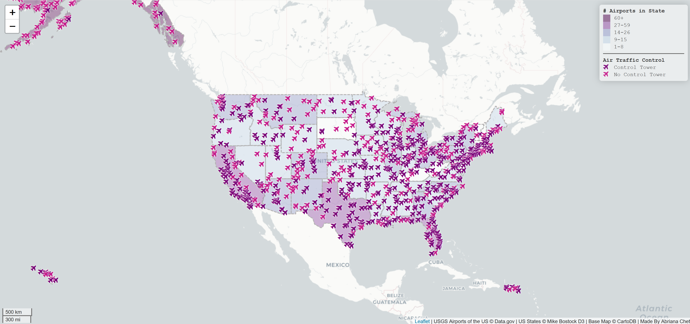

# US Airports Map

https://chetva.github.io/simplewebmap/

This map shows the locations of airports in the U.S. This also shows which airports have air traffic control towers and which do not. Each state also shows the range of the number of airports it contains.

The locations of each airport is clickable and will show the name.

The libraries used include, leaflet.css, leaflet.js, leaflet.ajax, font-awesome.css, chroma.js, jquery.min.js, and google fonts. Data sources are from shapefile from https://catalog.data.gov/dataset/usgs-small-scale-dataset-airports-of-the-united-states-201207-shapefile and Mike Bostock of D3. Acknowledgments: This lab was originally designed in the context of Oregon. Kevin Ko's assistance in upgrading the lab material is appreciated.
